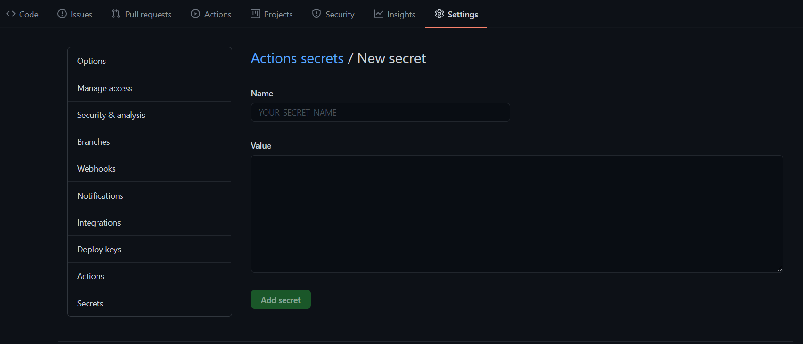
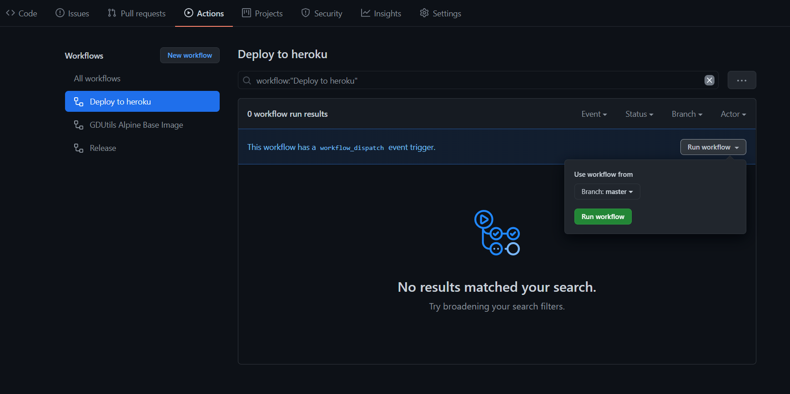
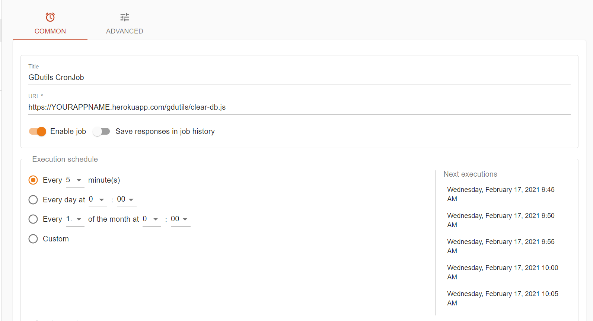
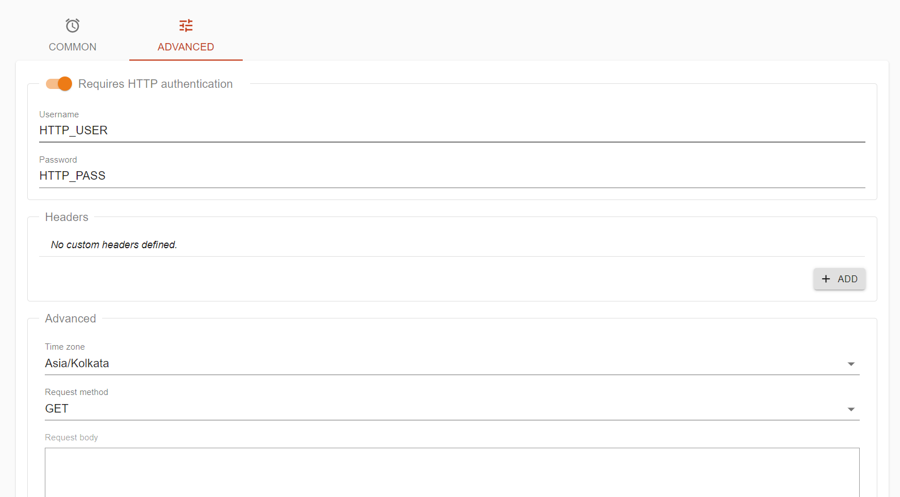

<div align="center">
<h1>GDUtils Terminal + Bot</h1>
<h3>Gd-Utils is just another Tool which helps us to Bypass the 750GB daily limit by Google</h3>
</div>
🌟 This repo is just for heroku deployment of GDUtils

### Pre Requisites
1️⃣ [Github Account](https://github.com)

2️⃣ [Heroku Account](https://heroku.com)

3️⃣ [Telegram Account](https://telegram.org)

4️⃣ [Some Patience](https://google.com)

### Deployment
🔷 Here I Don't Provide any Deploy button to heroku, We Use Github Actions to Deploy container to Heroku 

#### Steps

1. Fork this Repo
2. Go to Repository `Settings` -> `Secrets`
    
3. Now set the below Variables in the Github Repository Secrets
    [Environmental Variables](#Environmental)
4. After Setting this go to Actions and Run the Workflow
   
5. Now Go to the App URL and Press the link shown Below
   
6. Now it Opens the Web Terminal
   
7. Now Copy paste the Below Line's and Paste it there and press enter
8. 
    🔷 if You have given HTTP Basic Auth Vars then Use the Below One

    ```
    > curl -F "url=https://${HTTP_USER}:${HTTP_PASS}@${APP_NAME}.herokuapp.com/gutils/api/gdurl/tgbot" "https://api.telegram.org/bot${BOT_TOKEN}/setWebhook"
    ```
    🔷 Else Use the Below One

    ```
    > curl -F "url=https://${APP_NAME}.herokuapp.com/gutils/api/gdurl/tgbot" "https://api.telegram.org/bot${BOT_TOKEN}/setWebhook"
    ```
9. Done You Bot is Now Live and You can use the terminal Even if you want and Can generate Snap2HTML and Tree
   🔷 To access your files in your working directory go to 
    ```
    https://YOURAPP.herokuapp.com/gdutils/
    ```


### Environmental Variables

| Variable | Value | Example | Required | Description |
| :---: | :---: | :---: | :---: | :---: |
| HEROKU_EMAIL | Heroku email | abc@abc.com | True | Just Give the email you used for Heroku Account|
| HEROKU_API_KEY | Heroku API key | xxxxxxx-xxxx-xxxx-xxxx-xxxxxx | True | Get it from [Heroku](https://dashboard.heroku.com/account/applications/authorizations/new) |
| REGION | Heroku Container Region | EU | False | Needed only if you need  a EU Container |
| HEROKU_APP | Heroku app name | Name Must be unique | True | Heroku app name that needs to be Updated or Created (Should be in lowercase) |
| SA_ZIP | Direct Link | https://abc.com/sa.zip | False* | Service accounts to be zipped in a way that there should be a folder named accounts containing SA Jsons |
| GH_REPO | SA repo name | accounts | False** | Git repo name where SA's are Uploaded |
| GH_USER | Github Username | Nenokkadine | False** | Github username Where SA are uploaded |
| GH_AUTH_TOKEN | Github Auth Token | xxxxxxxxxxxxxx | False** | Get this from [Github](https://github.com/settings/tokens/new) With Scopes `repo` |
| BOT_TOKEN | Telegram Bot Token | 123456:abcdef | True | Get this from [Telegram](https://t.me/botfather) |
| AUTH_CHATS | Authorized Chats | 'UserA','UserB' | True | Telegram Username's Should be Given and Should be in Single Quotes |
| HTTP_USER | Username | user | False | HTTP Basic auth adds an Extra Layer security for you app (recommended) |
| HTTP_PASS | Password | pass | False | HTTP Basic auth adds an Extra Layer security for you app (recommended) |

### How to make the App Never Sleep?
1. Setup a [CronJob](https://console.cron-job.org) to Make the heroku app never sleep
   - First Sign-up in the above Site
   - Then Go [here](https://console.cron-job.org/jobs/create), and Follow the ScreenShot below
        
   - If you have Setup Basic HTTP Auth you should fill these too
         
   - Now you can save and enable the cron job, and your app never Sleeps again.
2. Use [Kaffine](https://kaffeine.herokuapp.com/) and Just give the app name, App's With Basic HTTP Auth enabled Might not work here

### Credits
👏 [iwestlin](https://github.com/iwestlin) - The original Developer of this tool

👏 [Roshan](https://github.com/roshanconner123) - Translated Entire repo into English

👏 [Shuanglei Tao](https://github.com/tsl0922) - Developer of TTYD (Terminal over Web)

## License
[MIT](https://choosealicense.com/licenses/mit/)
